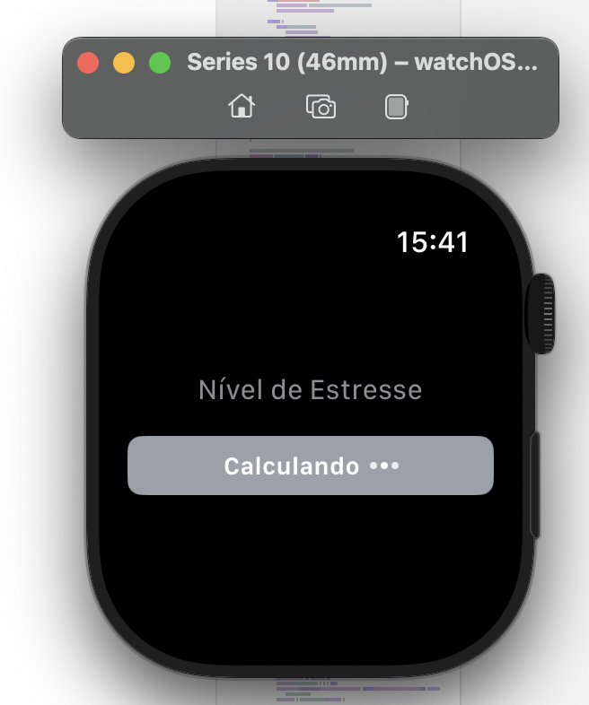

Stress Level Monitoring App
---
The Stress Level Monitoring App is a Swift-based application that tracks an individual’s stress levels using health metrics such as:

Heart Rate (HR)
Heart Rate Variability (HRV)
Resting Heart Rate (RHR)
Sleep Duration
This project integrates machine learning with user-friendly app design to deliver real-time stress level predictions.

Apple Watch Interface
---
Below are screenshots of the app interface on the Apple Watch:

  
  

The dataset for the app was sourced from an Apple Watch Series 6. Key steps in the development process include:
---
Data Cleaning and Feature Extraction: Extracted relevant features from the raw dataset.
Data Augmentation: Since the dataset primarily consisted of normal readings, data augmentation was performed to balance it.
Labeling: Stress levels were categorized into three classes:
Low Stress
Medium Stress
High Stress
A Random Forest model was trained using this processed data to classify stress levels.

Model Training Results
Below is the result of the model training:

Technologies Used
---
SwiftUI: For building the user interface.
Core Data: For local storage when needed.
REST API: To send health data to a remote server and retrieve predicted stress levels.
Timer: Periodically sends real-time health data to the prediction model for live updates.
Testing

To test the application:
---
Simulated health data was sent from the SwiftUI code to the REST API.
The Random Forest model, trained with Apple Watch data, returned predictions in three stress categories (low, medium, high).
How to Use
Clone the repository.
Install the necessary dependencies.
Deploy the REST API server.
Run the app on your Apple Watch or iOS simulator.

Contributions
---
Feel free to fork this repository and open pull requests for any enhancements or bug fixes.
